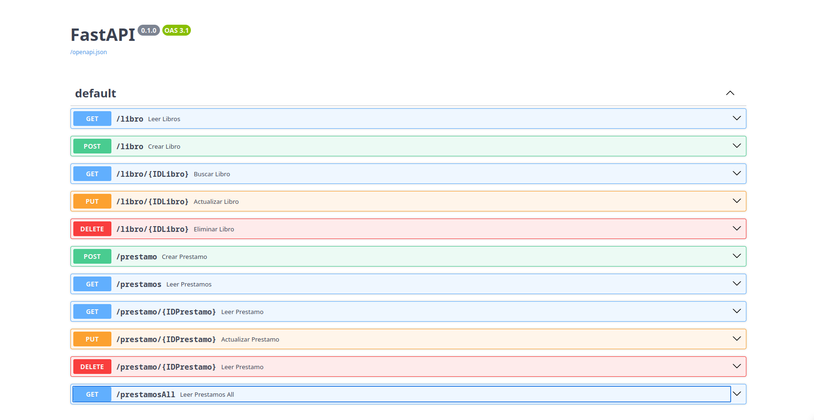
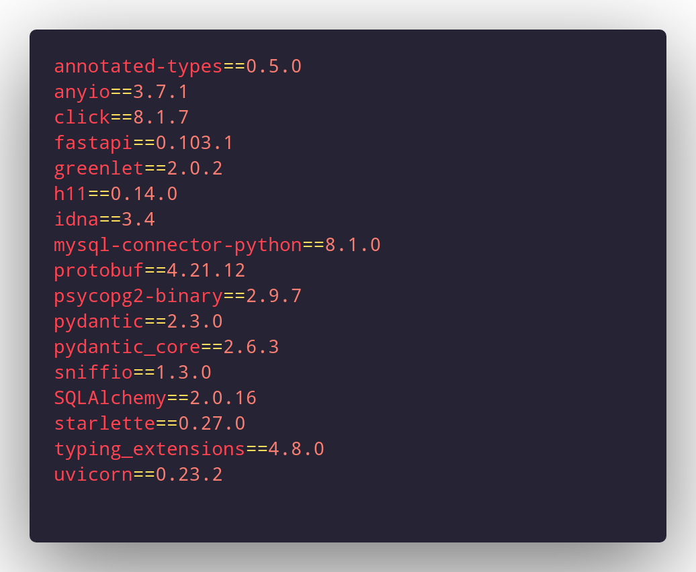

# API REST en FastAPI usando MySQL

Esta API REST fue desarrollada utilizando FastAPI en Python y se conecta a una base de datos MySQL. Proporciona operaciones CRUD (Crear, Leer, Actualizar y Eliminar) para gestionar libros y prestamos.

## Contenido

1. [Descripción](#descripción)
1. [Endpoints de la API](#endpoints-de-la-api)
2. [Paquetes de la API](#paquetes-de-la-api)

    2.1 [config](#config)

    2.2 [models](#models)

    2.3 [routers](#routers)

    2.4 [schemas](#schemas)

    2.5 [main.py](#main)

3. [Funcionalidades](#funcionalidades)
4. [Capturas de Pantalla](#capturas-de-pantalla)
5. [Requisitos](#requisitos)
6. [Instalación](#instalacion)
7. [Uso](#uso)
8. [Contribución](#contribución)

## Descripción
Esta API REST está diseñada para gestionar información relacionada con libros y préstamos. La API incluye dos recursos principales: libros y préstamos. Cada préstamo está vinculado a un libro específico mediante su identificador (ID de libro). Esta documentación te guiará a través de los paquetes y funcionalidades clave de la API.

## Endpoints de la API

A continuación se muestra un resumen de los endpoints disponibles en la API:

| Endpoint                | Método | Descripción                                      |
|-------------------------|--------|--------------------------------------------------|
| `/libro`                | GET    | Obtiene la lista de todos los libros.           |
| `/libro`                | POST   | Crea un nuevo libro.                             |
| `/libro/{IDLibro}`      | GET    | Obtiene la información de un libro por su ID.   |
| `/libro/{IDLibro}`      | PUT    | Actualiza la información de un libro existente. |
| `/libro/{IDLibro}`      | DELETE | Elimina un libro por su ID.                      |
| `/prestamo`             | POST   | Crea un nuevo préstamo.                         |
| `/prestamos`            | GET    | Obtiene la lista de todos los préstamos.        |
| `/prestamo/{IDPrestamo}`| GET    | Obtiene la información de un préstamo por su ID. |
| `/prestamo/{IDPrestamo}`| PUT    | Actualiza la información de un préstamo existente. |
| `/prestamo/{IDPrestamo}`| DELETE | Elimina un préstamo por su ID.                   |
| `/prestamoAll`          | GET    | Obtiene la lista de préstamos con información detallada sobre los libros prestados (a través de una operación de JOIN). |


## Paquetes de la API

### config

db.py: Este módulo contiene la configuración y la conexión a la base de datos mysql utilizada por la API.

### models

libro.py: Define el modelo de datos para los libros, incluyendo atributos como el título, el autor y otros detalles relevantes.
prestamo.py: Define el modelo de datos para los préstamos, incluyendo el ID del libro prestado y la información del prestatario.

### routers

libro.py: Este módulo contiene los endpoints básicos para operaciones CRUD (Crear, Leer, Actualizar y Borrar) relacionadas con los libros.
prestamo.py: Este módulo contiene los endpoints básicos para operaciones CRUD relacionadas con los préstamos, así como un endpoint adicional que devuelve los préstamos con información detallada sobre los libros mediante una operación de JOIN.

### schemas

libro.py: Define los esquemas de datos (schemas) utilizados para validar y serializar los datos de los libros.
prestamo.py: Define los esquemas de datos (schemas) utilizados para validar y serializar los datos de los préstamos.

### main.py

Este archivo incluye la configuración principal de la aplicación FastAPI y agrupa los routers para los recursos de libros y préstamos. Es el punto de entrada de la aplicación.

## Funcionalidades

La API ofrece las siguientes funcionalidades:

### Libros:
Crear un nuevo libro. Leer la información de un libro por su ID. Actualizar la información de un libro existente Eliminar un libro.

### Préstamos:
Crear un nuevo préstamo, especificando el ID del libro prestado. Leer la información de un préstamo por su ID. Actualizar la información de un préstamo existente. Eliminar un préstamo.Obtener una lista de préstamos con información detallada sobre los libros prestados (a través de una operación de JOIN).

## Capturas de Pantalla


*Vista en Swagger de las APIs*

## Requisitos

Antes de utilizar esta API, asegúrate de tener los siguientes requisitos:

* Python 3.6 o superior.

* Bibliotecas Python requeridas (instaladas automáticamente durante la instalación). Puedes instalarlas utilizando el archivo requirements.txt, que contiene las siguientes dependencias:


*requirements.txt*

## Instalación

1. Clona este repositorio en tu máquina local:

``` bash
git clone https://github.com/tu-usuario/tu-repo.git
```

2. Accede al directorio del proyecto:

``` bash
cd tu-repo
```

3. Crea un entorno virtual (recomendado):

``` bash
python -m venv venv
```

4. Activa el entorno virtual:

* En Windows:

``` bash
venv\Scripts\activate
```

* En macOS y Linux:
    
``` bash
source venv/bin/activate
```

5. Instala las dependencias del proyecto:

``` bash
pip install -r requirements.txt
```

## Uso

Para ejecutar la API, asegúrate de estar en el directorio del proyecto y de tener el entorno virtual activado (si lo creaste). Luego, ejecuta el siguiente comando:

``` bash
uvicorn main:app --reload
```

La API estará disponible en http://localhost:8000/docs.

## Contribución

Si deseas contribuir a este proyecto, por favor sigue estos pasos:

1. Realiza un fork del repositorio.
2. Crea una rama con tu nueva característica o corrección: git checkout -b mi-caracteristica.
3. Realiza tus cambios y haz commits: git commit -m 'Agrega nueva característica'.
4. Sube tus cambios a tu repositorio en GitHub: git push origin mi-caracteristica.
5. Crea un Pull Request en el repositorio original.